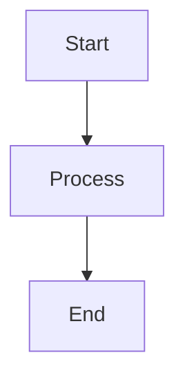

# All Syntaxes Demo

This note exercises every Markdown and extension syntax supported by Notes Web.

## Headings

### Third-level heading

#### Fourth-level heading

## Table of contents anchor

The TOC panel renders links to [[#Wikilinks and aliases|this heading's anchor]].

## GFM Table

| Feature     | Status   | Priority |
|-------------|----------|----------|
| Wikilinks   | ✅ Done  | High     |
| Callouts    | ✅ Done  | High     |
| Mermaid     | 🚧 WIP   | Medium   |

## Ordered and unordered lists

- Unordered item
- Nested unordered
  - Level two
    - Level three
- Back to level one

1. First ordered
2. Second ordered
   1. Nested ordered A
   2. Nested ordered B
3. Third ordered

## Task checkboxes and metadata

- [ ] Uncategorised task
- [x] Completed task 📅 2026-06-01 ✅ 2026-06-01
- [ ] Task with due date 📅 2026-07-15
- [ ] High-priority task ⏫ 📅 2026-06-20
- [ ] Medium priority 🔼
- [ ] Low priority 🔽
- [ ] Task with repeat 🔁 weekly
- [x] Done with task ID <!-- tid:DEMO-001 -->

## Footnotes

Here is a sentence with a footnote reference.[^1]

[^1]: This is the footnote content.

## Code blocks

```go
package main

import "fmt"

func main() {
	fmt.Println("Hello, Notes Web!")
}
```

## Raw HTML

<div class="raw-html-marker" data-testid="raw-html">Raw HTML block</div>

## Callouts

> [!note] Custom title
> This is a note callout with a custom title.

> [!warning]
> A warning callout with default title.

> [!todo]-
> A collapsed todo callout.

## Mermaid



## Wikilinks and aliases

Unique wikilink: [[Target Note]]
Wikilink with alias: [[Target Note|Aliased Link]]
Wikilink with heading: [[Target Note#Section A]]
Missing wikilink: [[NonExistentTarget]]
Ambiguous wikilink: [[Resolve One]]

## External content

External link: [Notes Web](https://example.com)
Local image: 

Missing local image: 

Non-previewable local media: 

## More headings for backlink context

### Section about wikilinks

Backlink sources reference this heading.
